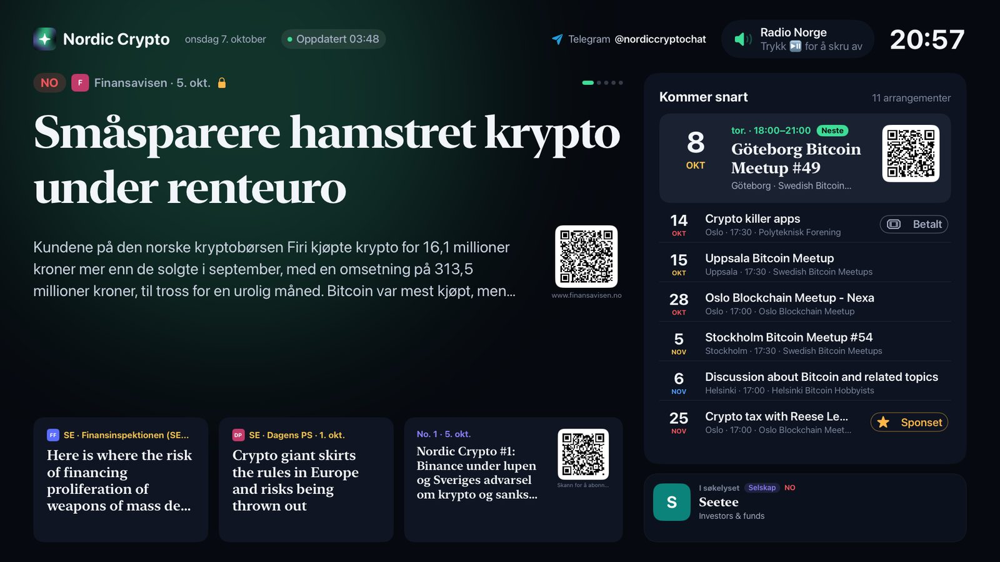
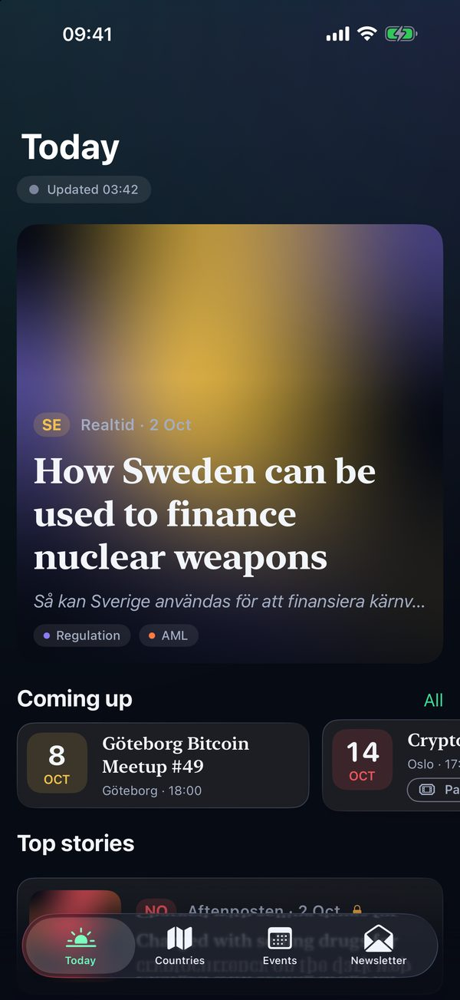
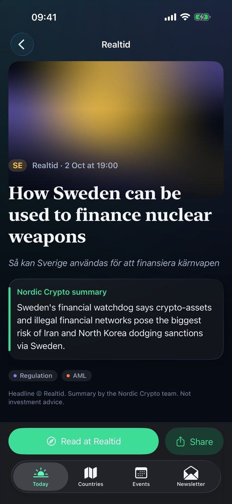
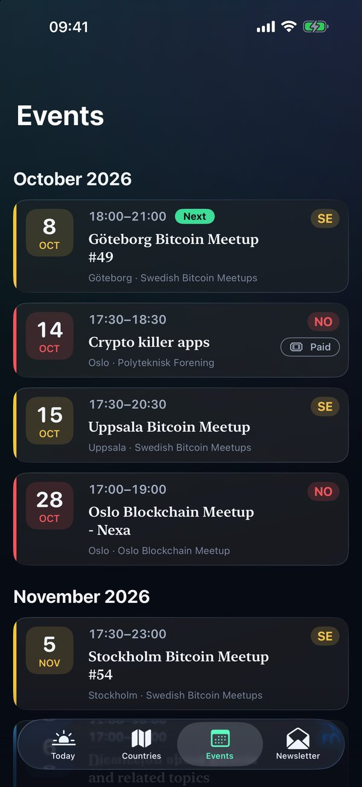
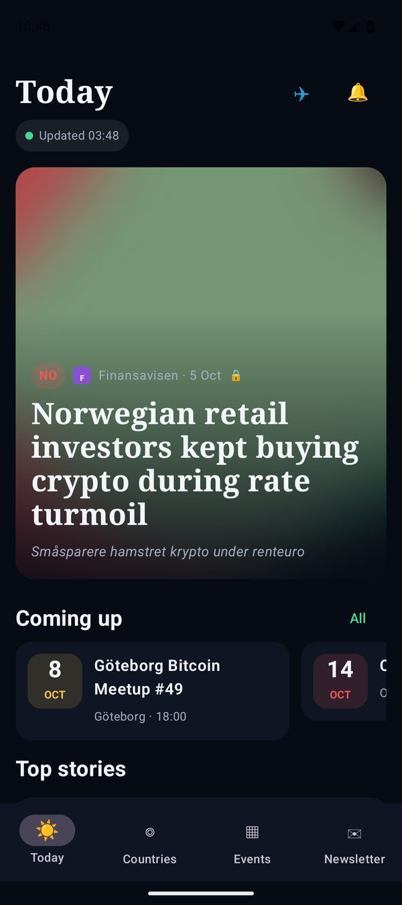
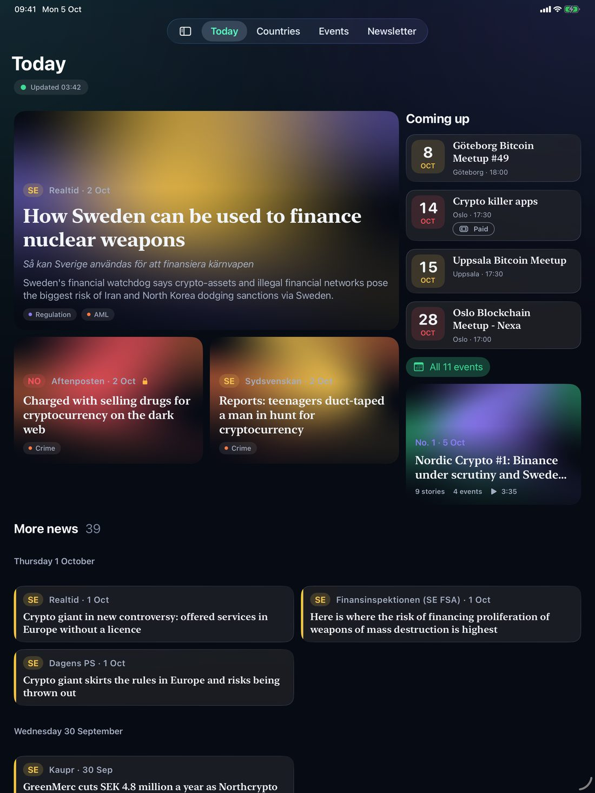
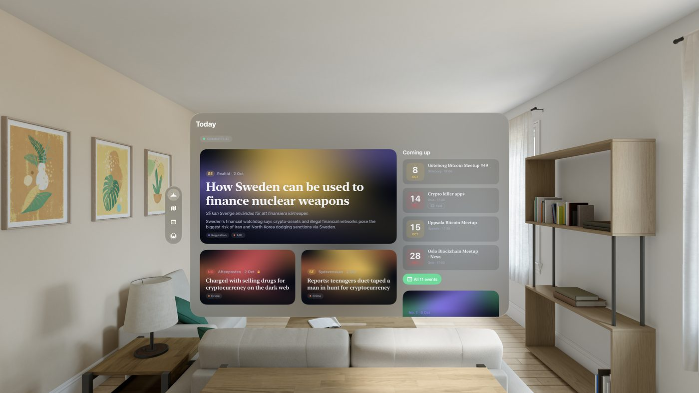
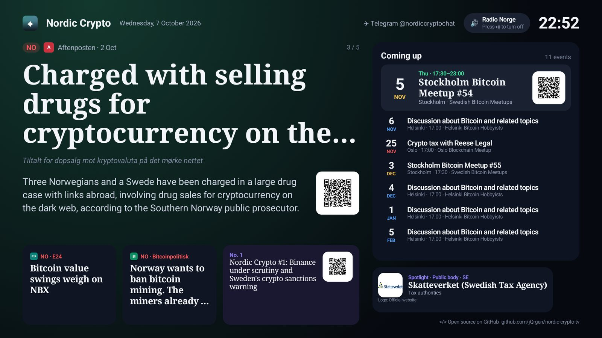

# Nordic Crypto

**The Nordic crypto news desk on every screen you own.** Bitcoin, crypto and blockchain news from
Norway, Sweden, Denmark, Finland and Iceland, summarised by people, in your language, on Apple TV,
iPhone, iPad, Mac, Apple Vision Pro and Android.



## Why Nordic Crypto

Nordic crypto news is scattered over dozens of newspapers, regulators and blogs in five languages,
half of them behind paywalls. Nordic Crypto reads them all and gives you one calm front page:

- **Every story, explained.** Each headline comes with a short summary written by the Nordic Crypto
  team, a link to the original source and the outlet's logo. Drafts are checked before anything is
  published.
- **Your language.** The interface speaks 21 languages; summaries come in English, Norwegian
  (bokmål and nynorsk), Swedish, Danish, Finnish and Icelandic.
- **What's on.** Meetups, conferences and talks across the Nordics, with dates, places and a QR code
  to sign up.
- **Who's who.** A spotlight on the people, companies, regulators and university courses that shape
  Nordic crypto.
- **A screen that stays on.** On Apple TV and Android TV the app is an information screen for the
  office, the meetup or the living room: lead stories, the agenda and the spotlight rotate on their
  own while Radio Norge plays in the background (Play/Pause turns it off).
- **Private by design.** No account, no tracking, no ads. Notifications for new stories are checked
  on the device.

Not investment advice. Headlines belong to their publishers.

## Try it

- **TestFlight (iPhone, iPad, Mac, Vision Pro, Apple TV):** https://testflight.apple.com/join/nQ2fpjZn
- **Community:** [@nordiccryptochat](https://t.me/nordiccryptochat) on Telegram
- **Website and API:** [nordiccrypto.no](https://nordiccrypto.no)

## Screenshots

| iPhone | | | Android |
|---|---|---|---|
|  |  |  |  |

| iPad | Apple Vision Pro |
|---|---|
|  |  |

| Android TV |
|---|
|  |

## What's in the box

| Platform | What you get |
|---|---|
| iPhone, iPad | Today, Countries, Events and Newsletter tabs; story and event pages that open the source; notifications per country |
| Mac | The same in a window with a sidebar, a menu bar menu with the latest headlines, notifications every 15 minutes |
| Apple Vision Pro | The iPad layout in a glass window; the newsreel opens in its own window |
| Apple TV | The "Kveldsnytt" information screen: lead story, agenda with QR codes, spotlight, Radio Norge |
| Android phone, tablet | Today, Countries, Events and Newsletter, notifications per country |
| Android TV | The same information screen as Apple TV, with Radio Norge |

All of it is built on the open [Nordic Crypto data API](https://github.com/jQrgen/nordic-crypto) (`/api/v1/`).

## Build it yourself

### Apple (SwiftUI, one multiplatform target)
```sh
brew install xcodegen
xcodegen generate
open NordicCrypto.xcodeproj
```
- Tests: `xcodebuild test -scheme NordicCrypto -destination 'platform=tvOS Simulator,name=<sim>'`
- Icons and Top Shelf art: `python3 support/make_brand_assets.py`
- Translations: `python3 support/translations.py` writes `NordicCrypto/Localizable.xcstrings`
- App Store listing and screenshots: see `support/appstore/`

### Android (Kotlin, Jetpack Compose)
```sh
cd android
./gradlew :app:assembleDebug        # app/build/outputs/apk/debug/app-debug.apk
```
The Android app reads the same `Localizable.xcstrings`, so every platform says the same thing.
Release builds are signed with an upload key from `android/keystore.properties` (not in the repo).

### Data
The apps try `https://nordiccrypto.no/api/v1/` first, then the older addresses. The last good
response is cached, and a snapshot of the API ships with the apps, so the first launch and offline
use always show content. `support/refresh_snapshot.sh` refreshes it.

## Licence and contributing
MIT, see [LICENSE](LICENSE). Issues and pull requests are welcome. The news data comes from the
[Nordic Crypto API](https://github.com/jQrgen/nordic-crypto) (also MIT); headlines belong to their
publishers. Radio Norge is a third-party stream and is not covered by this licence. Signing keys,
App Store Connect keys and Play upload keys are never part of this repository.
